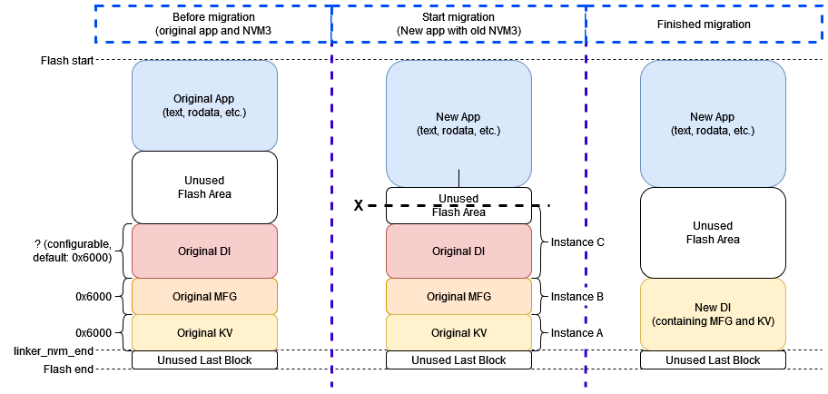
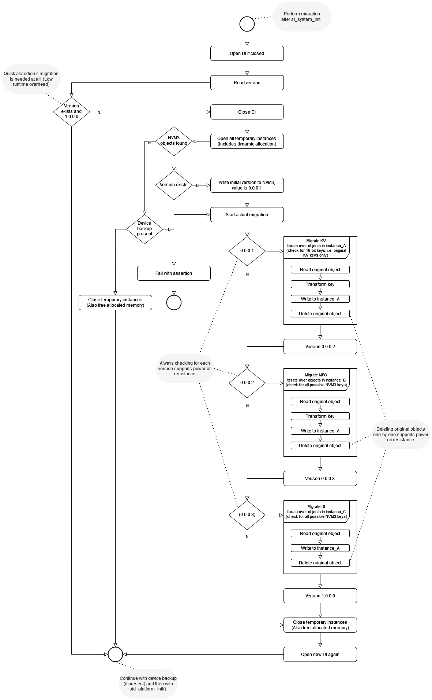

# Amazon Sidewalk - NVM3 Migrator Component

This component is responsible for automatically handling the changes in the NVM3 structure around the Sidewalk SDK 1.16 release (Sidewalk extension 2.0.0). More precisely, it migrates NVM3 data from the previous unversioned Silabs-specific structure to a new structure which also got a version number, namely 1.0.0.0. This includes migration of manufacturing page (MFG) and Key-Value storage data (the KV storage handles the state of the Sidewalk stack) and other Silabs-specific NVM3 data as well.

The goal is to provide seamless transition to the new structure by simply adding this component, and calling its single API function.

For more information about the latest NVM3 organization, refer to [Non-Volatile Memory Management in Sidewalk Context](/amazon-sidewalk/{build-docspace-version}/sidewalk-app-development#non-volatile-memory-use).

## Component Overview

The `Sidewalk NVM3 Migrator` component provides:

- **Data Migration**: Automatic migration of NVM3 data structures
- **Version Compatibility**: Handles changes between Sidewalk versions
- **Backward Compatibility**: Ensures data integrity during updates
- **Migration Logging**: Tracks migration operations for debugging

The rework of the NVM3 organization has two important advantages:

* Reduce the flash usage to store the same information.
* The address of the reserved space for the default NVM3 instance can be easily changed, thus changing MFG and KV storage address seamlessly.

## Usage

The following schema shows the main stages of the memory migration.

1. Before migration, we see the assumed original NVM3 structure.
   * NVM3 data is placed at the end of the flash.
   * The MFG and KV instances are 0x6000 large.
   * The size of the original NVM3 Default instance is also 0x6000 by default.
2. When we start migration we expect that the user flashed a new application containing the migrator component, and left the NVM3 data intact.
   * The new application shall not overlap with the original NVM3 data.
3. After the migration we see the new NVM3 structure containing MFG and KV storage data.

The full migration process is shown in the following flow diagram:

### Integration Steps

1. **Add Component**: Include `Sidewalk NVM3 Migrator` in your project
2. **Configure NVM3**: Ensure NVM3 library is properly configured
3. **Call Migration Function**: Call `sl_sidewalk_nvm3_migrator_run()` to execute the migration

## Report Bugs & Get Support

For technical support, bug reports, or questions about this component, please visit the [Silicon Labs Community](https://community.silabs.com).

For more detailed information about the NVM3 Migrator component, see the [Sidewalk Stack Structure documentation](https://docs.silabs.com/amazon-sidewalk/latest/sidewalk-stack-structure/#sidewalk-nvm3-migrator).

## License

This component is licensed under:
- **Zlib License**: Silicon Labs software license

See the component source files for complete license information. 