# Sidewalk OTA DFU (Over-the-Air Device Firmware Upgrade)

The component *"Sidewalk OTA DFU"* helps users perform the device firmware upgrades over a Sidewalk network.

## Table of Contents

- [General Steps](#general-steps)
- [Demo - Testing the OTA DFU service with the "Amazon Sidewalk - SoC CLI" example (On *Windows OS*)](#demo---testing-the-ota-dfu-service-with-the-amazon-sidewalk---soc-cli-example-on-windows-os)

## General Steps

**1. Firmware image preparation**

- A new firmware image to upgrade the device needs to be prepared and then uploaded to an S3 bucket on AWS.
    > **Ⓘ INFO Ⓘ**: [S3 (Simple Storage Service)](https://docs.aws.amazon.com/AmazonS3/latest/userguide/Welcome.html) is a storage service provided by Amazon Web Services (AWS). Please refer to [creating an S3 bucket](https://docs.aws.amazon.com/AmazonS3/latest/userguide/create-bucket-overview.html) and [uploading objects](https://docs.aws.amazon.com/AmazonS3/latest/userguide/upload-objects.html). 

**2. End device preparation**

1. Provision your device (please refer to this [**document**](https://docs.silabs.com/amazon-sidewalk/latest/sidewalk-getting-started/provision-your-device)).
2. Compile and flash a Sidewalk application.
3. Configure the device to connect to a Sidewalk network.
    > **Ⓘ INFO Ⓘ**: OTA DFU service is only supported on the ***BLE*** link currently.
4. Send an uplink message to the cloud before starting the OTA update.
    > **Ⓘ INFO Ⓘ**: This step is a ***workaround*** solution for the cloud to be able to locate the end-point.

**3. Perform the FUOTA (Firmware Update Over-The-Air) process through the Sidewalk network**

The FUOTA service can be performed through the AWS CLI
1.  Create a FUOTA task

    ```
    aws iotwireless create-fuota-task --firmware-update-image <your_s3_url_for_the_new_firmware_image_here> --firmware-update-role arn:aws:iam::<aws_i_am_user_id_here>:role/CFSFuotaServiceRole --protocol-type Sidewalk --name "ota_dfu_test" --fragment-size-bytes 1024
    ```

    - Read more about *S3 URLs* [here](https://repost.aws/questions/QUFXlwQxxJQQyg9PMn2b6nTg/what-is-s3-uri-in-simple-storage-service).
    - Read more about *AWS account ID* [here](https://docs.aws.amazon.com/IAM/latest/UserGuide/console_account-alias.html#ViewYourAWSId).

2. Save the created FUOTA task ID as an environment variable
- Windows:
    ```
    set FUOTA_TASK_ID=<fuota_task_id_obtained_from_previous_cmd_here>
    ```
- Linux:
    ```
    export FUOTA_TASK_ID=<fuota_task_id_obtained_from_previous_cmd_here>
    ```

3. Associate (a) wireless device(s) with the FUOTA task created above (to be called several times for tests with multiple end devices)
- Windows:
    ```
    aws iotwireless associate-wireless-device-with-fuota-task --wireless-device-id <wireless_device_id_here> --id %FUOTA_TASK_ID%
    ```
- Linux:
    ```
    aws iotwireless associate-wireless-device-with-fuota-task --wireless-device-id <wireless_device_id_here> --id ${FUOTA_TASK_ID}
    ```

4. Schedule the FUOTA task (the earliest 5 minutes from "now" can be scheduled and attention that it's ***GMT-0 time***)
- Windows:
    ```
    aws iotwireless start-fuota-task --id %FUOTA_TASK_ID% --sidewalk StartTime=<the_start_time_for_the_fuota_process_("yyyy-mm-ddThh:mm:ss")>
    ```
- Linux:
    ```
    aws iotwireless start-fuota-task --id ${FUOTA_TASK_ID} --sidewalk StartTime=<the_start_time_for_the_fuota_process_("yyyy-mm-ddThh:mm:ss")>
    ```

5. Get FUOTA status any time especially before, during and after at least once to check the cloud status
- Windows:
    ```
    aws iotwireless get-fuota-task --id &FUOTA_TASK_ID%
    ```
- Linux:
    ```
    aws iotwireless get-fuota-task --id ${FUOTA_TASK_ID}
    ```

6. List wireless devices to check device(s) status
- Windows:
    ```
    aws iotwireless list-wireless-devices --fuota-task-id %FUOTA_TASK_ID%
    ```
- Linux:
    ```
    aws iotwireless list-wireless-devices --fuota-task-id ${FUOTA_TASK_ID}
    ```

7. Delete the FUOTA task once the testing is terminated otherwise the associated wireless device is not released
- Windows:
    ```
    aws iotwireless delete-fuota-task --id %FUOTA_TASK_ID%
    ``` 
- Linux:
    ``` 
    aws iotwireless delete-fuota-task --id ${FUOTA_TASK_ID}
    ```

    > **Ⓘ INFO Ⓘ**: Each wireless device can only be associated with one FUOTA task.

## Demo - Testing the OTA DFU service with the "Amazon Sidewalk - SoC CLI" example (On *Windows OS*)

This is a testing demo demonstrating the use of the ***OTA DFU*** component installed by default in the ***Alpha*** version of the ["Amazon Sidewalk - SoC CLI"](https://github.com/SiliconLabs/amazon-sidewalk/tree/main/example/aws_sidewalk/amazon_sidewalk_soc_cli) application using the *EFR32xG24* radio board.

**1. Bootloader image preparation**

For the "Alpha - Amazon Sidewalk - SoC CLI" application, a ***bootloader*** is required to upgrade the firmware once the new image is received. To flash a bootloader, create and build a ***"Bootloader - SoC Internal Storage"*** project from Simplicity Studio 5 for the supported target while keeping the default bootloader configuration (slot size, application start address, etc).

<p align="center">
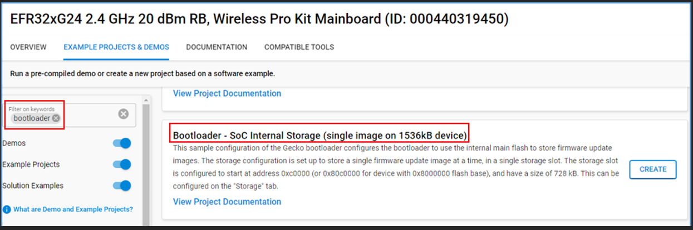
</p>

**2. Firmware image preparation**

1. Generate and build the ***"Amazon Sidewalk - SoC CLI"*** application.

<p align="center">
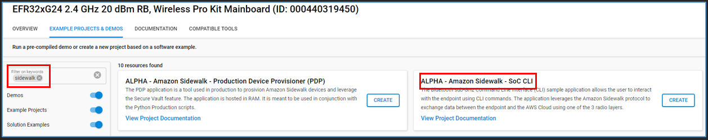
</p>

2. After compiling successfully, save the below s37 executable as ***cli_v1.s37***.

<p align="center">
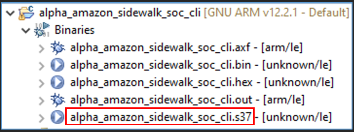
</p>

3. Modify the ***"APP_VERSION"*** macro value from "1" to "2" in example/aws_sidewalk/amazon_sidewalk_soc_cli/amazon_sidewalk_soc_cli_<family>.slcp and repeat the previous step and save the s37 executable as ***cli_v2.s37***.

4. Convert the file ***cli_v2.s37*** into ***GBL*** format

- Go to the file path containing the ***"commander.exe"*** file of Simplicity Studio 5 then open a terminal (command prompt, git bash, etc.) there.

- Use the command below to convert file ***cli_v2.s37*** into ***cli_v2.gbl***:

    ```
    commander gbl create /path/to/cli_v2.gbl --app /path/to/cli_v2.s37
    ```

**3. End device preparation**

1. Provision your device.
2. Flash ***cli_v1.s37*** to the device.
3. Launch Jlink and connect to telnet to interact with the cloud through CLI.
4. Initialize BLE link
    ```
    sid init ble
    ```
5. Start BLE link
    ```
    sid start ble
    ```
6. Initialize OTA DFU service
    ```
    sid ota_dfu init
    ```
7. Request for the BLE connection
    ```
    sid bleconnect
    ```
8. Send an uplink message to the cloud
    ```
    sid send notify hello
    ```

**4. Cloud side preparation**

- **AWS S3**

    - There is an S3 bucket automatically generated by the cloud formation template with the name starting with ***sidewalk-sl*** followed by ***a series of random numbers*** for your bucket to be unique across AWS.
    - Upload the GBL file ***cli_v2.gbl*** to that S3 bucket to update to the device later.

- **AWS CLI Set-Up**

    To use the OTA DFU service for the alpha version of "SoC CLI" example, an updated version of AWS CLI needs to be installed. Please follow the instructions in the document ***Python CLi steps.pdf*** stored [here](python_cli_steps) while the ***three wheels files (.whl)*** used to install the AWS CLI are stored [here](../../tools/scripts/public/python-cli-wheels-files/).

- **Firmware update over-the-air (FUOTA) for AWS IoT Core**

    1. Create a FUOTA task
    
    <p align="center">
    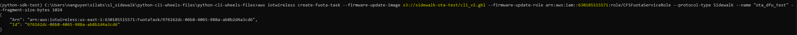
    </p>

    2. Save the created FUOTA task ID as an environment variable
    
    <p align="center">
    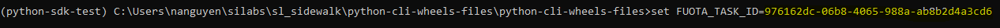
    </p>

    3. Associate the wireless device with the FUOTA task created above

    - The wireless device ID:
    
    <p align="center">
    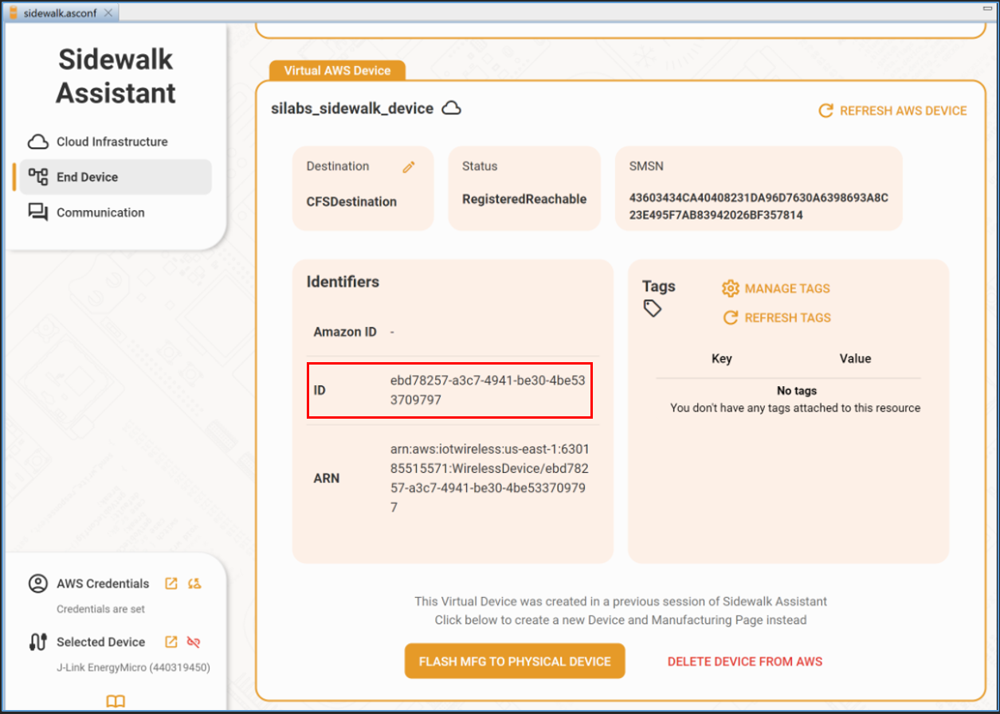
    </p>

    - Associate the device ID ebd78257-a3c7-4941-be30-4be533709797 with the FUOTA task

    <p align="center">
    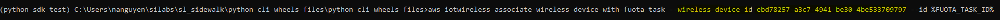
    </p>

    4. Schedule the FUOTA task at 5h00 a.m. GMT+0 on 05/04/2024 for this demo test

    <p align="center">
    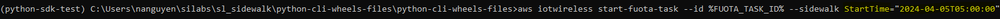
    </p>

    5. Get FUOTA status any time especially before, during and after at least once to check the cloud status
    
    <p align="center">
    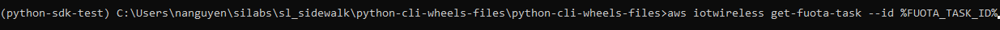
    </p>

    
    - FUOTA task status (read more [here](https://docs.aws.amazon.com/iot-wireless/2020-11-22/apireference/API_GetFuotaTask.html)):
        - FuotaSession_Waiting: The FUOTA task is waiting until the start time scheduled
        - In_FuotaSession: The OTA update is in progress
        - FuotaDone: The FUOTA task has been done
    
    6. List wireless devices to check device status
    <p align="center">
    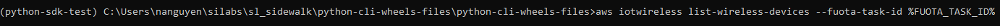
    </p>

    - FuotaDeviceStatus (read more [here](https://sdk.amazonaws.com/java/api/latest/software/amazon/awssdk/services/iotwireless/model/FuotaDeviceStatus.html)):
        - Initial: The OTA update has been started
        - Successful: The OTA update is successful

    7. Delete the FUOTA task once the testing is terminated
    
    <p align="center">
    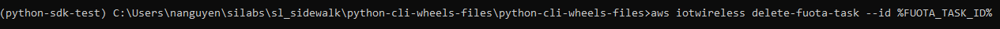
    </p>

**5. Testing results**

- On the cloud side:
    - Wireless device status

        - The *FuotaDeviceStatus* returns ***"Successful"*** which means the device's firmware is updated successfully

    <p align="center">
    
    </p>

- On the device side:
    - Check the application logs on J-Link RTT Viewer, the ***"APP_VERSION"*** has been updated to version 2.

    <p align="center">
    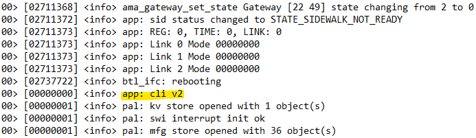
    </p>
    